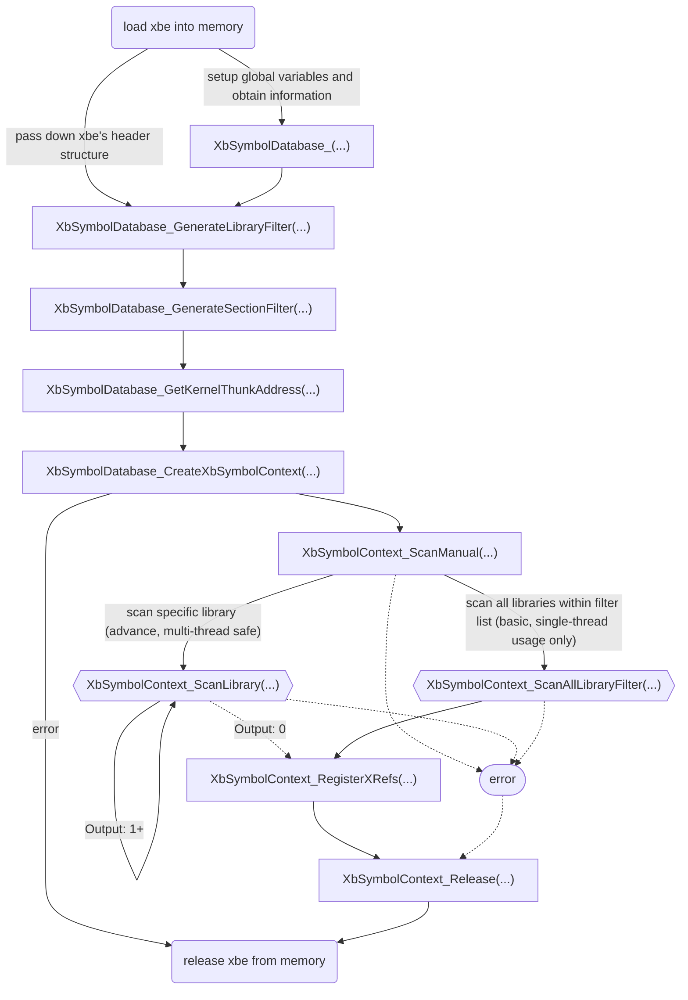

Draft chart for process to use functions:

```mermaid
graph TD;
    a(load xbe into memory) -- pass down xbe's header structure --> 1;
    a -- setup global variables and obtain information --> b;
    b["XbSymbolDatabase_(...)"] --> 1;
    1["XbSymbolDatabase_GenerateLibraryFilter(...)"] --> 2;
    2["XbSymbolDatabase_GenerateSectionFilter(...)"] --> 3;
    3["XbSymbolDatabase_GetKernelThunkAddress(...)"] --> 4;
    4["XbSymbolDatabase_CreateXbSymbolContext(...)"] --> 5;
    4 -- error --> z;
    5["XbSymbolContext_ScanManual(...)"] -- "scan specific library (advance, multi-thread safe)" --> 6a;
    5 -- "scan all libraries within filter list (basic, single-thread usage only)" --> 6b;
    5 -.-> 8e;
    6a{{"XbSymbolContext_ScanLibrary(...)"}} -. Output: 0 .-> 7;
    6a{{"XbSymbolContext_ScanLibrary(...)"}} -- Output: 1+ --> 6a;
    6b{{"XbSymbolContext_ScanAllLibraryFilter(...)"}} --> 7;
    6a -.-> 8e;
    6b -.-> 8e;
    7["XbSymbolContext_RegisterXRefs(...)"] --> 8;
    8e([error]) -.-> 8;
    8["XbSymbolContext_Release(...)"] --> z;
    z(release xbe from memory);
    click 1 href "https://github.com/Cxbx-Reloaded/XbSymbolDatabase/blob/master/include/libXbSymbolDatabase.h#:~:text=XbSymbolDatabase_GenerateLibraryFilter("
    click 2 href "https://github.com/Cxbx-Reloaded/XbSymbolDatabase/blob/master/include/libXbSymbolDatabase.h#:~:text=XbSymbolDatabase_GenerateSectionFilter("
    click 3 href "https://github.com/Cxbx-Reloaded/XbSymbolDatabase/blob/master/include/libXbSymbolDatabase.h#:~:text=XbSymbolDatabase_GetKernelThunkAddress("
    click 4 href "https://github.com/Cxbx-Reloaded/XbSymbolDatabase/blob/master/include/libXbSymbolDatabase.h#:~:text=XbSymbolDatabase_CreateXbSymbolContext("
    click 5 href "https://github.com/Cxbx-Reloaded/XbSymbolDatabase/blob/master/include/libXbSymbolDatabase.h#:~:text=XbSymbolContext_ScanManual("
    click 6a href "https://github.com/Cxbx-Reloaded/XbSymbolDatabase/blob/master/include/libXbSymbolDatabase.h#:~:text=XbSymbolContext_ScanLibrary("
    click 6b href "https://github.com/Cxbx-Reloaded/XbSymbolDatabase/blob/master/include/libXbSymbolDatabase.h#:~:text=XbSymbolContext_ScanAllLibraryFilter("
    click 7 href "https://github.com/Cxbx-Reloaded/XbSymbolDatabase/blob/master/include/libXbSymbolDatabase.h#:~:text=XbSymbolContext_RegisterXRefs("
    click 8 href "https://github.com/Cxbx-Reloaded/XbSymbolDatabase/blob/master/include/libXbSymbolDatabase.h#:~:text=XbSymbolContext_Release("
```
